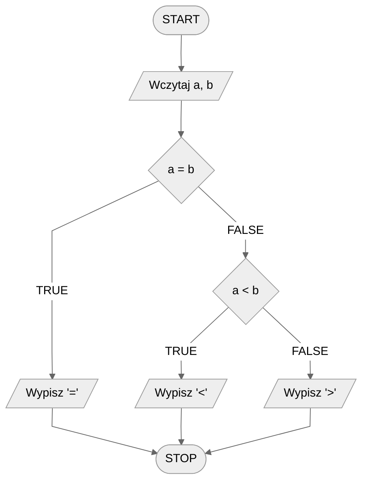

# Block diagram

```mermaid
%%{init: {"flowchart": {"curve": "linear"}, "theme": "neutral"} }%%
flowchart TD
    START([START]) --> K1[/Wczytaj a, b/]
    K1 --> K2{a = b}
    K2 -- TRUE --> K3[/Wypisz '='/]
    K2 -- FALSE --> K4{a < b}
    K4 -- TRUE --> K5[/Wypisz '<'/]
    K4 -- FALSE --> K7[/Wypisz '>'/]
    K3 --> STOP([STOP])
    K5 --> STOP
    K7 --> STOP 
```
