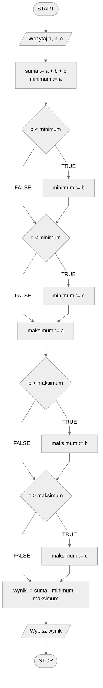

# Block diagram

```mermaid
%%{init: {"flowchart": {"curve": "linear"}, "theme": "neutral"} }%%
flowchart TD
    START([START]) --> K1[/Wczytaj a, b, c/]
    K1 --> K2["suma := a + b + c
    minimum := a"]
    K2 --> K4{b < minimum}
    K4 -- TRUE --> K5[minimum := b]
    K4 -- FALSE --> K6{c < minimum}
    K5 --> K6
    K6 -- TRUE --> K7[minimum := c]
    K6 -- FALSE --> K8[maksimum := a]
    K7 --> K8
    K8 --> K9{b > maksimum}
    K9 -- TRUE --> K10[maksimum := b]
    K9 -- FALSE --> K11{c > maksimum}
    K10 --> K11
    K11 -- TRUE --> K12[maksimum := c]
    K11 -- FALSE --> K13[wynik := suma - minimum - maksimum]
    K12 --> K13
    K13 --> K14[/Wypisz wynik/]
    K14 --> STOP([STOP])
```
