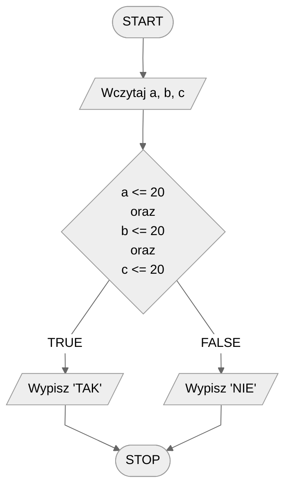

# Block diagram

```mermaid
%%{init: {"flowchart": {"curve": "linear"}, "theme": "neutral"} }%%
flowchart TD
    START([START]) --> K1[/Wczytaj a, b, c/]
    K1 --> K2{"a <= 20
    oraz
    b <= 20
    oraz
    c <= 20"}
    K2 -- TRUE --> K3[/Wypisz 'TAK'/]
    K2 -- FALSE --> K5[/Wypisz 'NIE'/]
    K3 --> STOP([STOP])
    K5 --> STOP
```
