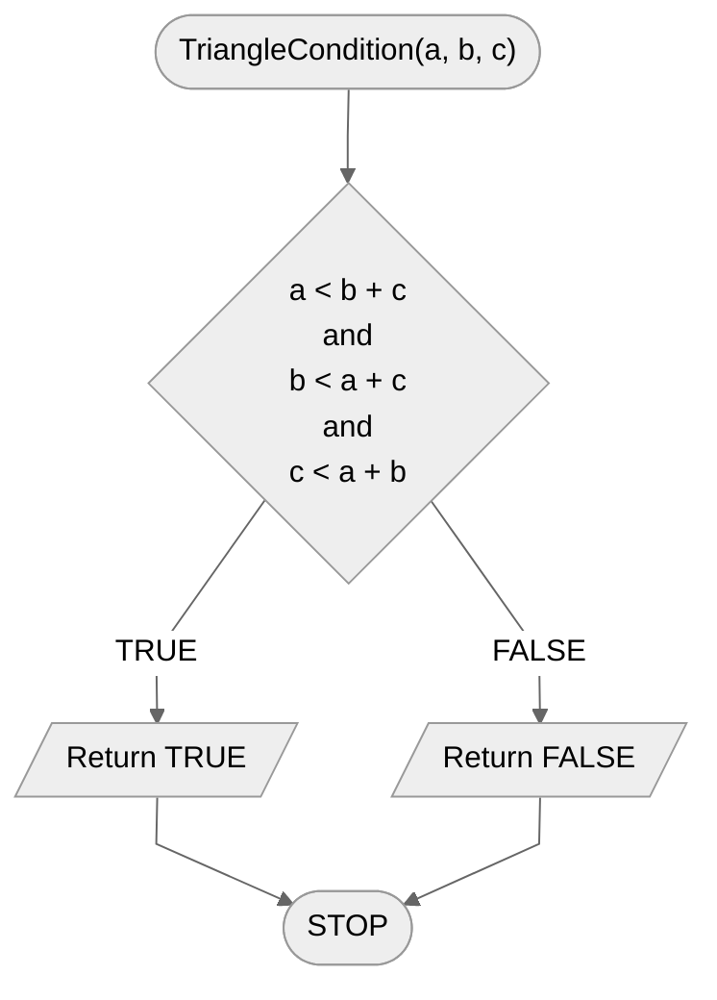

# Triangle condition

The triangle is one of the basic geometric figures. However, how to build it? First of all: we need three segments. However, they can not be any segments! They must meet the so-called **triangle condition**. The **triangle condition**.

## Specification

### Input

- $a, b, c$ - natural numbers, segment lengths, $a>0$, $b>0$, $c>0$.

### Output

- **TRUE** if a triangle can be constructed from the given segments,
- **FALSE** otherwise.

## Solution

In order to build a triangle from three segments, the following condition must be met: the length of each segment is less than the sum of the other two. From this it follows that we have three inequalities to check.

Alternatively, you can also check that the sum of the two smaller segments is greater than the length of the third, longest segment.

### Pseudocode

```
function TriangleCondition(a, b, c):
    1. If a < b + c and b < a + c and c < a + b, then:
        2. Return TRUE
    3. otherwise:
        4. Return FALSE
```

### Block diagram



## Implementation

### [:simple-cplusplus: C++](../../programming/c++/algorithms/2d-geometry/triangle-condition.md){ .md-button }

### [:simple-python: Python](../../programming/python/algorithms/2d-geometry/triangle-condition.md){ .md-button }
