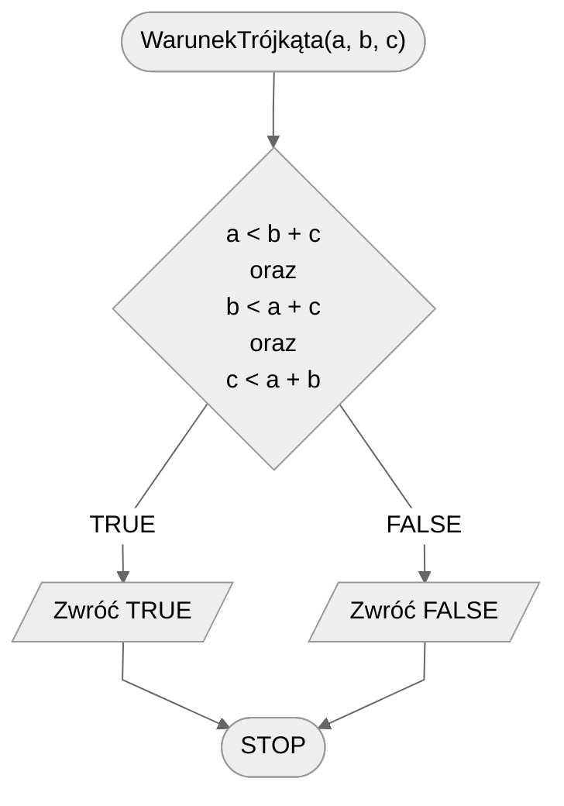

# Warunek trójkąta

Trójkąt jest jedną z podstawowych figur geometrycznych. Jak jednak go zbudować? Po pierwsze: potrzebujemy trzech odcinków. Nie mogą to jednak być dowolne odcinki! Muszą one spełniać tzw. **warunek trójkąta**.

## Specification

### Input

- $a, b, c$ - liczby naturalne, długości odcinków, $a>0$, $b>0$, $c>0$.

### Output

- **TRUE** jeżeli z podanych odcinków można zbudować trójkąt,
- **FALSE** w przeciwnym przypadku.

## Solution

Aby z trzech odcinków można było zbudować trójkąt, musi być spełniony następujący warunek: długość każdego odcinka jest mniejsza od sumy dwóch pozostałych. Z tego wynika, że mamy do sprawdzenia trzy nierówności.

Alternatywnie można także sprawdzić, czy suma dwóch mniejszych odcinków jest większa od długości trzeciego, najdłuższego odcinka.

### Pseudocode

```
funkcja WarunekTrójkąta(a, b, c):
    1. Jeżeli a < b + c oraz b < a + c oraz c < a + b, to:
        2. Zwróć TRUE
    3. w przeciwnym przypadku:
        4. Zwróć FALSE
```

### Block diagram



## Implementation

### [:simple-cplusplus: C++](../../programming/c++/algorithms/2d-geometry/triangle-condition.md){ .md-button }

### [:simple-python: Python](../../programming/python/algorithms/2d-geometry/triangle-condition.md){ .md-button }
