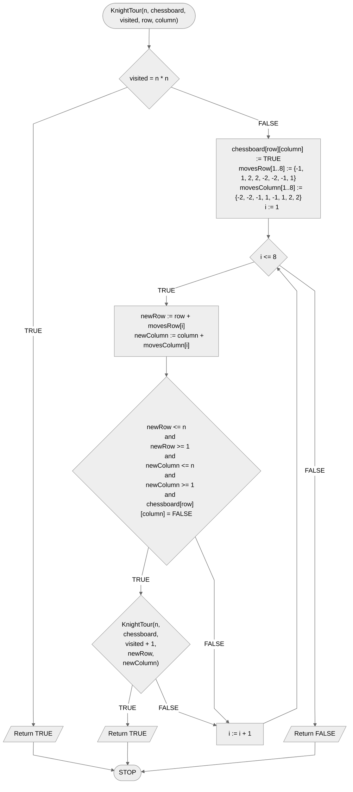

# Knight tour

The knight, otherwise known as the horse, is a chess figure that makes L-shaped moves, i.e. it can move two fields vertically and one horizontally, or two fields horizontally and one vertically. The problem associated with this figure is the following: starting from the lower left field of the chessboard, is the knight able to visit all fields exactly once?

## Specification

### Input

- $n$ - natural number, checkerboard dimensions, number of rows and columns, $n>0$.

### Output

- **TRUE** if the knight can visit all fields of the chessboard $n\times n$ exactly once,
- **FALSE** otherwise.

## Solution

The idea of the solution is relatively simple. We will recursively check all possible moves of the jumper. When we reach a place from which we can no longer make another move, we will go back to the previous field.

### Example

**Move 1**

|   | a | b | c | d |
|---|---|---|---|---|
| 4 |   |   |   |   |
| 3 |   |   |   |   |
| 2 |   |   |   |   |
| 1 | K |   |   |   |

**Move 2**

|   | a | b | c | d |
|---|---|---|---|---|
| 4 |   |   |   |   |
| 3 |   |   |   |   |
| 2 |   |   | K |   |
| 1 | X |   |   |   |

**Move 3**

|   | a | b | c | d |
|---|---|---|---|---|
| 4 |   |   |   | K |
| 3 |   |   |   |   |
| 2 |   |   | X |   |
| 1 | X |   |   |   |

**Move 4**

|   | a | b | c | d |
|---|---|---|---|---|
| 4 |   |   |   | X |
| 3 |   | K |   |   |
| 2 |   |   | X |   |
| 1 | X |   |   |   |

**Move 5**

|   | a | b | c | d |
|---|---|---|---|---|
| 4 |   |   |   | X |
| 3 |   | X |   |   |
| 2 |   |   | X |   |
| 1 | X |   | K |   |

**Move 6**

|   | a | b | c | d |
|---|---|---|---|---|
| 4 |   |   |   | X |
| 3 |   | X |   |   |
| 2 | K |   | X |   |
| 1 | X |   | X |   |

**Move 7**

|   | a | b | c | d |
|---|---|---|---|---|
| 4 |   | K |   | X |
| 3 |   | X |   |   |
| 2 | X |   | X |   |
| 1 | X |   | X |   |

**Move 8**

|   | a | b | c | d |
|---|---|---|---|---|
| 4 |   | X |   | X |
| 3 |   | X |   | K |
| 2 | X |   | X |   |
| 1 | X |   | X |   |

**Move 9**

|   | a | b | c | d |
|---|---|---|---|---|
| 4 |   | X |   | X |
| 3 |   | X |   | X |
| 2 | X | K | X |   |
| 1 | X |   | X |   |

**Move 10**

|   | a | b | c | d |
|---|---|---|---|---|
| 4 |   | X |   | X |
| 3 |   | X |   | X |
| 2 | X | K | X |   |
| 1 | X |   | X | X |

**Move 11**

|   | a | b | c | d |
|---|---|---|---|---|
| 4 |   | X | K | X |
| 3 |   | X |   | X |
| 2 | X | X | X |   |
| 1 | X |   | X | X |

**Move 12**

|   | a | b | c | d |
|---|---|---|---|---|
| 4 |   | X | X | X |
| 3 |   | X |   | X |
| 2 | X | X | X | K |
| 1 | X |   | X | X |

**Move 13**

|   | a | b | c | d |
|---|---|---|---|---|
| 4 |   | X | X | X |
| 3 |   | X |   | X |
| 2 | X | X | X | X |
| 1 | X | K | X | X |

**Move 14**

|   | a | b | c | d |
|---|---|---|---|---|
| 4 |   | X | X | X |
| 3 | K | X |   | X |
| 2 | X | X | X | X |
| 1 | X | X | X | X |

At this point, we can no longer make another move. So we go back to the previous situation of **move 13**.

|   | a | b | c | d |
|---|---|---|---|---|
| 4 |   | X | X | X |
| 3 |   | X |   | X |
| 2 | X | X | X | X |
| 1 | X | K | X | X |

Here we have another possibility of movement, which we have not checked before. We can move to the **c3** field. So we make **new** move 14.

**Move 14**

|   | a | b | c | d |
|---|---|---|---|---|
| 4 |   | X | X | X |
| 3 |   | X | K | X |
| 2 | X | X | X | X |
| 1 | X | X | X | X |

**Move 15**

|   | a | b | c | d |
|---|---|---|---|---|
| 4 | K | X | X | X |
| 3 |   | X | X | X |
| 2 | X | X | X | X |
| 1 | X | X | X | X |

Now we are also in a no-win situation. At this point, the algorithm would again retreat to the last position, where we still had an unexplored movement. However, this is what we will no longer present, we leave it as a stand-alone exercise.

### Pseudocode

```
function KnightTour(n, chessboard, visited, row, column):
    1. If visited = n * n, then:
        2. Return TRUE
    3. chessboard[row][column] := TRUE
    4. movesRow[1..8] := {-1, 1, 2, 2, -2, -2, -1, 1}
    5. movesColumn[1..8] := {-2, -2, -1, 1, -1, 1, 2, 2}
    6. From i := 1 to 8, do:
        7. newRow := row + movesRow[i]
        8. newColumn := column + movesColumn[i]
        9. If newRow <= n and newRow >= 1 and newColumn <= n and newColumn >= 1 and chessboard[row][column] = FALSE, then:
            10. If KnightTour(n, chessboard, visited + 1, newRow, newColumn), then:
                11. Return TRUE
    12. Return FALSE
```

### Block diagram



## Implementation

### [:simple-cplusplus: C++](../../programming/c++/algorithms/backtracking/knights-tour.md){ .md-button }

### [:simple-python: Python](../../programming/python/algorithms/backtracking/knights-tour.md){ .md-button }
