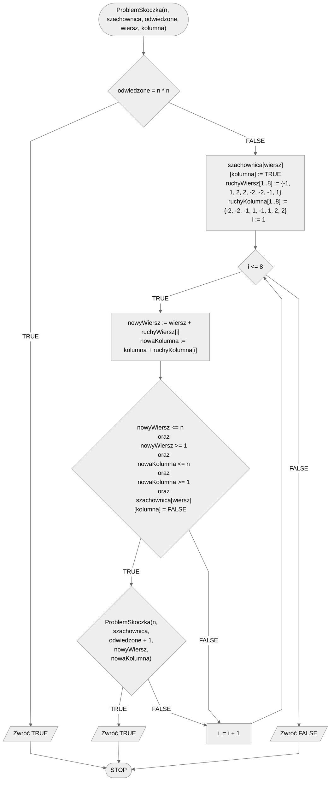

# Problem skoczka

Skoczek, zwany inaczej koniem, to figura szachowa która wykonuje ruchy w kształcie litery L, tzn. może przemieścić się o dwa pola w pionie i jedno w poziomie, lub o dwa pola w poziomie i jedno w pionie. Problem związany z tą figurą jest następujący: czy zaczynając z lewego dolnego pola szachownicy skoczek jest w stanie odwiedzić wszystkie pola dokładnie raz?

## Specification

### Input

- $n$ - liczba naturalna, wymiary szachownicy, liczba wierszy i kolumn, $n>0$.

### Output

- **TRUE** jeżeli skoczek może odwiedzić wszystkie pola szachownicy $n\times n$ dokładnie raz,
- **FALSE** w przeciwnym przypadku.

## Solution

Idea rozwiązania jest stosunkowo prosta. Będziemy rekurencyjnie sprawdzać wszystkie możliwe ruchy skoczka. Gdy dojdziemy do miejsca, z którego nie będziemy mogli już wykonać kolejnego ruchu, to cofniemy się do poprzedniego pola.

### Example

**Ruch 1**

|   | a | b | c | d |
|---|---|---|---|---|
| 4 |   |   |   |   |
| 3 |   |   |   |   |
| 2 |   |   |   |   |
| 1 | K |   |   |   |

**Ruch 2**

|   | a | b | c | d |
|---|---|---|---|---|
| 4 |   |   |   |   |
| 3 |   |   |   |   |
| 2 |   |   | K |   |
| 1 | X |   |   |   |

**Ruch 3**

|   | a | b | c | d |
|---|---|---|---|---|
| 4 |   |   |   | K |
| 3 |   |   |   |   |
| 2 |   |   | X |   |
| 1 | X |   |   |   |

**Ruch 4**

|   | a | b | c | d |
|---|---|---|---|---|
| 4 |   |   |   | X |
| 3 |   | K |   |   |
| 2 |   |   | X |   |
| 1 | X |   |   |   |

**Ruch 5**

|   | a | b | c | d |
|---|---|---|---|---|
| 4 |   |   |   | X |
| 3 |   | X |   |   |
| 2 |   |   | X |   |
| 1 | X |   | K |   |

**Ruch 6**

|   | a | b | c | d |
|---|---|---|---|---|
| 4 |   |   |   | X |
| 3 |   | X |   |   |
| 2 | K |   | X |   |
| 1 | X |   | X |   |

**Ruch 7**

|   | a | b | c | d |
|---|---|---|---|---|
| 4 |   | K |   | X |
| 3 |   | X |   |   |
| 2 | X |   | X |   |
| 1 | X |   | X |   |

**Ruch 8**

|   | a | b | c | d |
|---|---|---|---|---|
| 4 |   | X |   | X |
| 3 |   | X |   | K |
| 2 | X |   | X |   |
| 1 | X |   | X |   |

**Ruch 9**

|   | a | b | c | d |
|---|---|---|---|---|
| 4 |   | X |   | X |
| 3 |   | X |   | X |
| 2 | X | K | X |   |
| 1 | X |   | X |   |

**Ruch 10**

|   | a | b | c | d |
|---|---|---|---|---|
| 4 |   | X |   | X |
| 3 |   | X |   | X |
| 2 | X | K | X |   |
| 1 | X |   | X | X |

**Ruch 11**

|   | a | b | c | d |
|---|---|---|---|---|
| 4 |   | X | K | X |
| 3 |   | X |   | X |
| 2 | X | X | X |   |
| 1 | X |   | X | X |

**Ruch 12**

|   | a | b | c | d |
|---|---|---|---|---|
| 4 |   | X | X | X |
| 3 |   | X |   | X |
| 2 | X | X | X | K |
| 1 | X |   | X | X |

**Ruch 13**

|   | a | b | c | d |
|---|---|---|---|---|
| 4 |   | X | X | X |
| 3 |   | X |   | X |
| 2 | X | X | X | X |
| 1 | X | K | X | X |

**Ruch 14**

|   | a | b | c | d |
|---|---|---|---|---|
| 4 |   | X | X | X |
| 3 | K | X |   | X |
| 2 | X | X | X | X |
| 1 | X | X | X | X |

W tym momencie nie możemy już wykonać kolejnego ruchu. Cofamy się więc do poprzedniej sytuacji z **ruchu 13**. 

|   | a | b | c | d |
|---|---|---|---|---|
| 4 |   | X | X | X |
| 3 |   | X |   | X |
| 2 | X | X | X | X |
| 1 | X | K | X | X |

Tutaj mamy jeszcze jedną możliwość ruchu, której wcześniej nie sprawdziliśmy. Możemy poruszyć się na pole **c3**. Wykonujemy więc **nowy** ruch 14.

**Ruch 14**

|   | a | b | c | d |
|---|---|---|---|---|
| 4 |   | X | X | X |
| 3 |   | X | K | X |
| 2 | X | X | X | X |
| 1 | X | X | X | X |

**Ruch 15**

|   | a | b | c | d |
|---|---|---|---|---|
| 4 | K | X | X | X |
| 3 |   | X | X | X |
| 2 | X | X | X | X |
| 1 | X | X | X | X |

Teraz także jesteśmy w sytuacji bez wyjścia. W tym momencie algorytm ponownie wycofałby się do ostatniej pozycji, w którym mieliśmy jeszcze niezbadany ruch. Tego jednak nie będziemy już prezentować, pozostawiamy jako samodzielne ćwiczenie.

### Pseudocode

```
funkcja ProblemSkoczka(n, szachownica, odwiedzone, wiersz, kolumna):
    1. Jeżeli odwiedzone = n * n, to:
        2. Zwróć TRUE
    3. szachownica[wiersz][kolumna] := TRUE
    4. ruchyWiersz[1..8] := {-1, 1, 2, 2, -2, -2, -1, 1}
    5. ruchyKolumna[1..8] := {-2, -2, -1, 1, -1, 1, 2, 2}
    6. Dla i := 1 do 8, wykonuj:
        7. nowyWiersz := wiersz + ruchyWiersz[i]
        8. nowaKolumna := kolumna + ruchyKolumna[i]
        9. Jeżeli nowyWiersz <= n oraz nowyWiersz >= 1 oraz nowaKolumna <= n oraz nowaKolumna >= 1 oraz szachownica[wiersz][kolumna] = FALSE, to:
            10. Jeżeli ProblemSkoczka(n, szachownica, odwiedzone + 1, nowyWiersz, nowaKolumna), to:
                11. Zwróć TRUE
    12. Zwróć FALSE
```

### Block diagram



## Implementation

### [:simple-cplusplus: C++](../../programming/c++/algorithms/backtracking/knights-tour.md){ .md-button }

### [:simple-python: Python](../../programming/python/algorithms/backtracking/knights-tour.md){ .md-button }
