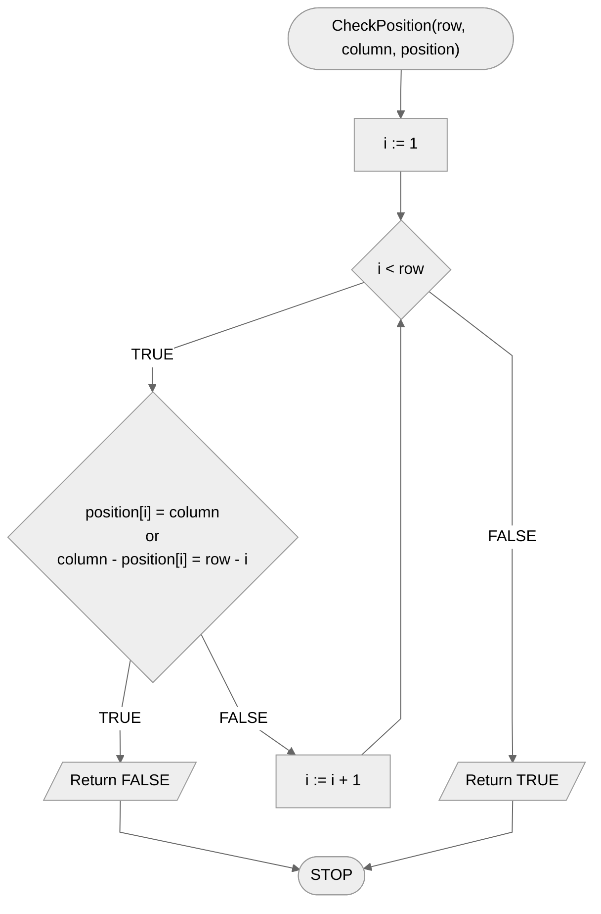
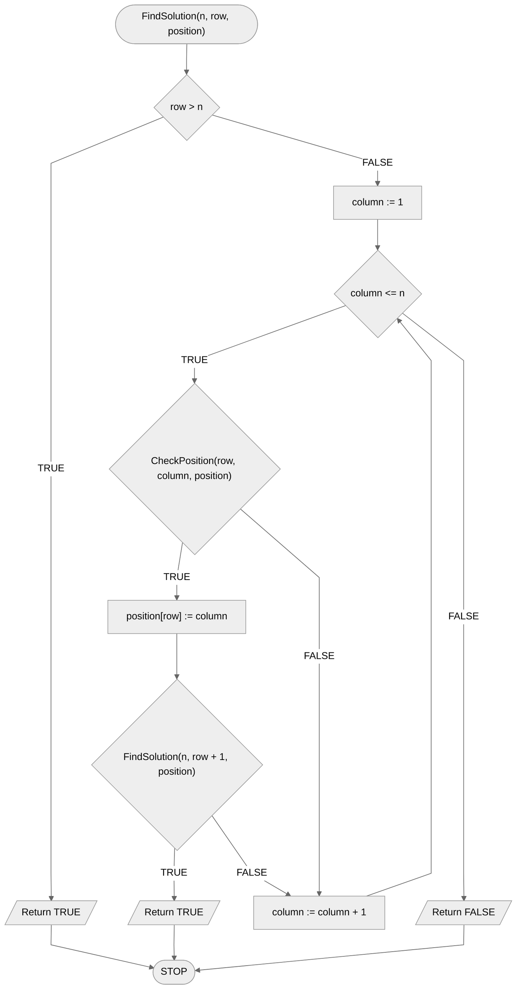

# The problem of n queens

The $n$ queens problem is one of the classic algorithmic problems related to chess. The problem reads as follows: given a $n$ chessboard and $n$ queens, can **all** the queens be placed on the chessboard so that **no** two of them attack each other?

We'll start by citing a dance search that demonstrates how the algorithm works for a $4$ checkerboard of $4\times 4$ and $4$ queens. We will then turn to the formal specification.

## Dance search

[:material-video: Dance search](https://www.youtube.com/watch?v=R8bM6pxlrLY){ .md-button }

## Specification

### Input

- $n$ - natural number, the number of queens to pitch

### Output

- **TRUE** if there is a correct solution
- **FALSE** otherwise

## Example 1

### Input

```
n := 3
```

### Output

**FALSE**

## Example 2

### Input

```
n := 4
```

### Output

**TRUE**

Example setting (`H` means queen, and `-` means an empty field):

```
- - H -
H - - -
- - - H
- H - -
```

## Solution

The idea behind our solution is simple. We will go row by row and try all possible queen settings in a row. After setting the queen in a particular row, we move to the next row, where we again check all possible settings.

Of course, in this way we would be checking many wrong settings. Therefore, before setting a new queen, we will check that it is a correct setting, i.e. that this field is not already attacked by any other queen.

In order to check if a field is not attacked by another queen, we need to go through all the previous rows and check if the queen set in a particular row is not attacking the current field vertically or diagonally.

### Pseudocode

```
function CheckPosition(row, column, position):
    1. From i := 1 to row - 1, do:
        2. If position[i] = column or column - position[i] = row - i, then:
            3. Return FALSE
    4. Return TRUE
```

```
function FindSolution(n, row, position):
    1. If row > n, then:
        2. Return TRUE
    3. From column := 1 to n, do:
        4. If CheckPosition(row, column, position), then:
            5. position[row] := column
            6. If FindSolution(n, row + 1, position), then:
                7. Return TRUE
    8. Return FALSE
```

### Block diagram





## Implementation

### [:simple-cplusplus: C++](../../programming/c++/algorithms/backtracking/n-queens.md){ .md-button }

### [:simple-python: Python](../../programming/python/algorithms/backtracking/n-queens.md){ .md-button }

### [:simple-kotlin: Kotlin](../../programming/kotlin/algorithms/backtracking/n-queens.md){ .md-button }

## Implementation - rest

### [:simple-julia: Julia](../../programming/julia/algorithms/backtracking/n-queens.md){ .md-button }
