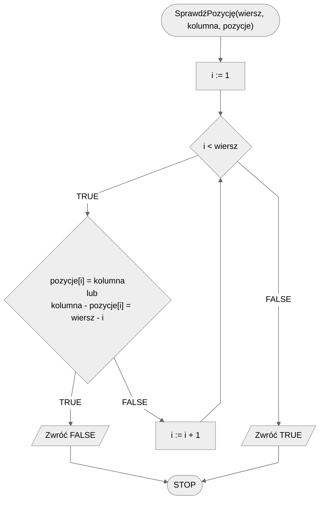
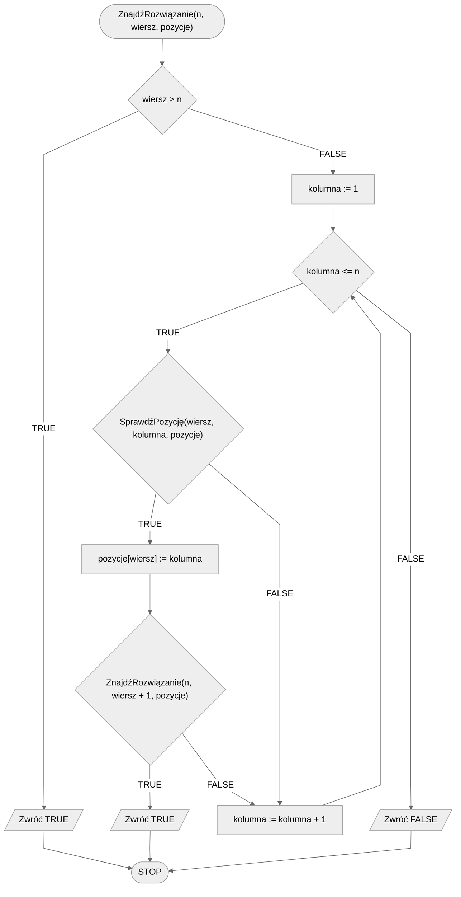

# Problem n królowych

Problem $n$ królowych to jeden z klasycznych problemów algorytmicznych związanych z szachami. Problem brzmi następująco: mając szachownicę $n\times n$ oraz $n$ królowych, czy można ustawić **wszystkie** królowe na szchownicy, tak by **żadne** dwie się wzajemnie nie atakowały?

Zaczniemy od przytoczenia tanecznego przeszukiwania, które demonstruje działanie algorytmu dla szachownicy $4\times 4$ oraz $4$ królowych. Następnie przejdziemy do formalnej specyfikacji.

## Taneczne przeszukiwanie

[:material-video: Taneczne przeszukiwanie](https://www.youtube.com/watch?v=R8bM6pxlrLY){ .md-button }

## Specification

### Input

- $n$ - liczba naturalna, liczba królowych do rozstawienia

### Output

- **TRUE** jeżeli istnieje poprawne rozwiązanie
- **FALSE** w przeciwnym przypadku

## Example 1

### Input

```
n := 3
```

### Output

**FALSE**

## Example 2

### Input

```
n := 4
```

### Output

**TRUE**

Przykładowe ustawienie (`H` oznacza królową, a `-` puste pole):

```
- - H -
H - - -
- - - H
- H - -
```

## Solution

Idea naszego rozwiązania jest prosta. Będziemy przechodzić wiersz po wierszu i próbować wszystkie możliwe ustawienia królowych w wierszu. Po ustawieniu królowej w danym wierszu przechodzimy do kolejnego wiersza, gdzie ponownie sprawdzamy wszystkie możliwe ustawienia.

Oczywiście w ten sposób sprawdzalibyśmy wiele błędnych ustawień. Dlatego przed ustawieniem nowej królowej będziemy sprawdzać, czy jest to poprawne ustawienie, tzn. czy to pole nie jest już atakowane przez żadną inną królową.

W celu sprawdzenia, czy dane pole nie jest atakowane przez inną królową, musimy przejść przez wszystkie poprzednie wiersze i sprawdzić, czy królowa ustawiona w danym wierszu nie atakuje obecnego pola w pionie lub na ukos.

### Pseudocode

```
funkcja SprawdźPozycję(wiersz, kolumna, pozycje):
    1. Dla i := 1 do wiersz - 1, wykonuj:
        2. Jeżeli pozycje[i] = kolumna lub kolumna - pozycje[i] = wiersz - i, to:
            3. Zwróć FALSE
    4. Zwróć TRUE
```

```
funkcja ZnajdźRozwiązanie(n, wiersz, pozycje):
    1. Jeżeli wiersz > n, to:
        2. Zwróć TRUE
    3. Dla kolumna := 1 do n, wykonuj:
        4. Jeżeli SprawdźPozycję(wiersz, kolumna, pozycje), to:
            5. pozycje[wiersz] := kolumna
            6. Jeżeli ZnajdźRozwiązanie(n, wiersz + 1, pozycje), to:
                7. Zwróć TRUE
    8. Zwróć FALSE
```

### Block diagram





## Implementation

### [:simple-cplusplus: C++](../../programming/c++/algorithms/backtracking/n-queens.md){ .md-button }

### [:simple-python: Python](../../programming/python/algorithms/backtracking/n-queens.md){ .md-button }

### [:simple-kotlin: Kotlin](../../programming/kotlin/algorithms/backtracking/n-queens.md){ .md-button }

## Implementation - pozostałe

### [:simple-julia: Julia](../../programming/julia/algorithms/backtracking/n-queens.md){ .md-button }
