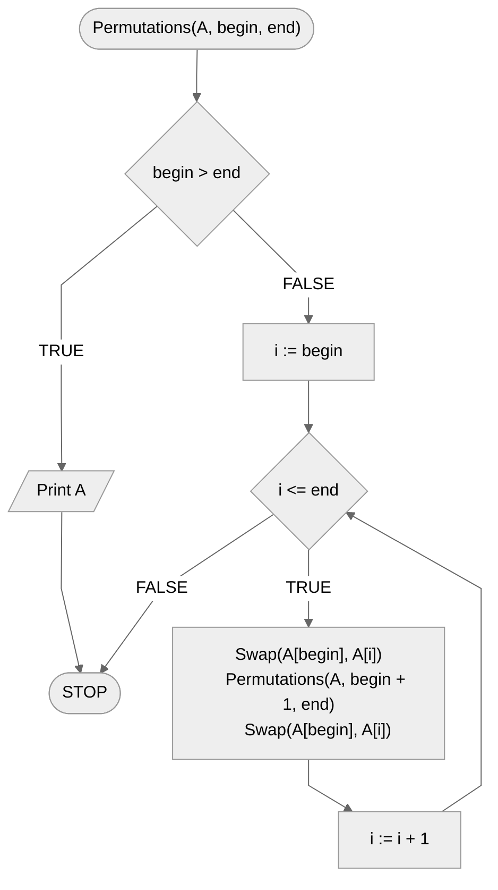

# Permutations

The permutation of an array specifies one of the ways to arrange the elements of that array. Sometimes in algorithmics we need all the permutations of an array, that is, all the possible ways to arrange its elements.

## Specification

### Input

* $n$ — natural number, the number of elements of the array, $n>0$
* $A[1..n]$ - $n$-element array,
* $begin$, $end$ - natural numbers that define the beginning and end of the permuted range of elements of the array, $1<=begin<=end<=n$

### Output

* All permutations of the $tab$ array

## Solution

We will create a recursive algorithm. By default, we start with the stop condition of the recursion. We will end the creation of the current permutation when the interval defined by the variables *begin* and *end* is not valid, i.e. when the beginning is **greater** than the end. This will mean that we have finished one permutation, so we can output it to the screen and end the current function call.

When the stop condition is not met, we will loop from the beginning to the end of the defined range. The loop counter will tell us what position to put the array element from the beginning of the checked range. So in the loop we will swap the array element under the current position with the element from the beginning of the range. We will then use a recursive call with the value of the beginning of the range increased by one. After the recursive call, we will swap the element at the current position with the element at the beginning of the range again in places, so as to restore the previous arrangement of elements in the array.

### Pseudocode

```
procedure Permutations(A, begin, end):
    1. If begin > end, then:
        2. Print A
        3. Stop
    4. From i := begin to end, do:
        5. Swap(A[begin], A[i])
        6. Permutations(A, begin + 1, end)
        7. Swap(A[begin], A[i])
```

### Block diagram



## Implementation

### [:simple-python: Python](../../programming/python/algorithms/backtracking/permutations.md){ .md-button }

### [:simple-kotlin: Kotlin](../../programming/kotlin/algorithms/backtracking/permutations.md){ .md-button }
