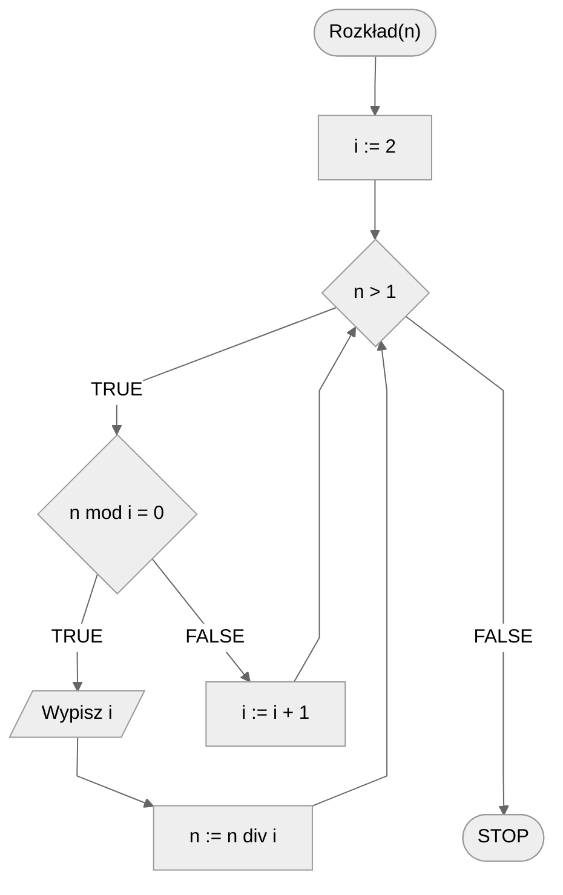

# Rozkład na czynniki pierwsze

Każdą liczbę naturalną większą od $1$ możemy rozłożyć na czynniki pierwsze, czyli przedstawić w postaci iloczynu liczb pierwszych. Tym problemem się właśnie zajmiemy.

## Specification

### Input

* $n$ - liczba naturalna, $n>1$.

### Output

* Rozkład liczby $n$ na czynniki pierwsze .

## Example

### Input

```
n := 124
```

**Output**: $2, 2, 31$ 

## Solution

Idea rozwiązania jest prosta. Zaczynamy od najmniejszej liczby pierwszej, czyli od liczby $2$. Dzielimy naszą liczbę $n$ przez naszą liczbę pierwszą, tak długo, jak się da, czyli jak długo jest podzielna. Następnie przechodzimy do kolejnej liczby pierwszej i powtarzamy operacje dzielenia. Całość powtarzamy, aż wynikiem dzielenia będzie wartość $1$.

### Pseudocode

```
funkcja Rozkład(n):
    1. i := 2
    2. Dopóki n > 1, wykonuj:
        3. Jeżeli n mod i = 0, to:
            4. Wypisz i
            5. n := n div i
        6. W przeciwnym przypadku:
            7. i := i + 1
```

!!! info
	**mod** oznacza resztę z dzielenia
	
	**div** oznacza dzielenie całkowite

### Block diagram



## Implementation

### [:simple-cplusplus: C++](../../programming/c++/algorithms/integers/prime-factors.md){ .md-button }

### [:simple-python: Python](../../programming/python/algorithms/integers/prime-factors.md){ .md-button }

## Implementation - pozostałe

### [:simple-haskell: Haskell](../../programming/haskell/algorithms/integers/prime-factors.md){ .md-button }

## Powiązane zagadnienia

- Znajdowanie wszystkich unikalnych czynników pierwszych zadanej liczby naturalnej.
- Obliczanie największego wspólnego dzielnika (NWD) dwóch liczb naturalnych.
- Obliczanie najmniejszej wspólnej wielokrotności (NWW) dwóch liczb naturalnych.
