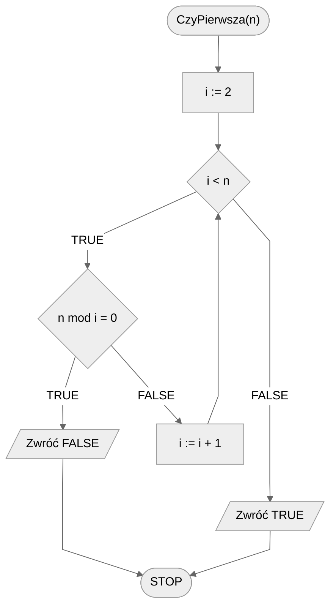
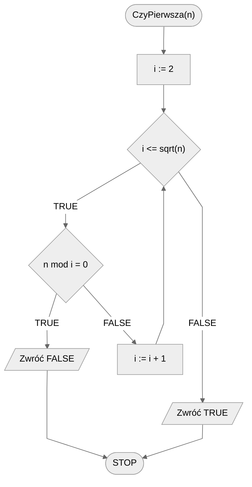

# Test pierwszości

Liczby pierwsze odgrywają w matematyce i informatyce znaczącą rolę, szczególnie w kryptografii. Zacznijmy od zdefiniowania czym jest liczba pierwsza:

!!! info
	**Liczba pierwsza**
	
	Liczbę naturalną, która jest podzielna wyłącznie przez $1$ i przez siebie samą, nazywamy **liczbą pierwszą**.

Naszym zadaniem jest sprawdzić, czy dana liczba naturalna jest liczbą pierwszą. Jednym ze sposobów jest sprawdzić, jakie dzielniki ma ta liczba. Nasze podejście do tego problemu będzie bardzo podobne jak w przypadku wypisania wszystkich dzielników liczby, dlatego warto najpierw zajrzeć do tego właśnie tematu: [Wszystkie dzielniki](divisors.md)

Jak zwykle zaczynamy od formalnej specyfikacji problemu i kilku prostych przykładów.

## Specification

### Input

* $n$ - liczba naturalna większa od $1$ 

### Output

* **TRUE**- jeżeli $n$ jest liczbą pierwszą
* **FALSE**- jeżeli $n$ nie jest liczbą pierwszą

!!! info
	 Dlaczego w specyfikacji wymagamy, żeby liczba $n$ była większa od $1$? Dla ułatwienia i zwiększenia czytelności rozwiązania. Wiadomo, że liczby $0$ i $1$ nie są liczbami pierwszymi. W związku z tym możemy je łatwo potraktować jako osobny przypadek, używając instrukcji warunkowej. To jednak zostawimy jako ćwiczenie do samodzielnego wykonania.

## Example 1

### Input

```
n := 7
```

**Output**: TRUE

!!! info
	**Wyjaśnienie**
	
	Dzielnikami liczby $7$ są $1$ i $7$, więc jest to liczba pierwsza.

## Example 2

### Input

```
n := 8
```

**Output**: FALSE

!!! info
	**Wyjaśnienie**
	
	Dzielnikami liczby 8 są $1,2,4$ i $8$, więc nie jest to liczba pierwsza.

## Solution zupełnie naiwne

W pierwszym rozwiązaniu postępować będziemy podobnie, jak w przypadku wypisywania wszystkich dzielników liczby. Są jednak dwie znaczące różnice. Po pierwsze nie interesuje nas, czy liczba jest podzielna przez $1$ i samą siebie, ponieważ z góry wiemy, że tak jest. Możemy więc nieznacznie zawęzić obszar poszukiwań. Po drugie nie interesuje nas jakie dokładnie dzielniki ma liczba, tylko **czy** ma jakieś dzielniki, różne od $1$ i niej samej. W związku z tym, jak tylko znajdziemy jakiś dzielnik, możemy od razu stwierdzić, że liczba nie jest pierwsza i zwrócić właściwą wartość, czyli FALSE i zakończyć obliczenia.

Jak jednak sprawdzić, że liczba jest pierwsza? To proste. Wystarczy, że nie znajdziemy żadnych dzielników. Jak nie znajdziemy dzielników, to nie zwrócimy wartości FALSE, tylko wyjdziemy z pętli. Jeśli tak się stanie, to znaczy, że liczba jest pierwsza, należy więc zwrócić wartość TRUE.

Podsumujmy nasze rozważania w formie gotowego algorytmu.

### Pseudocode

```
funkcja CzyPierwsza(n):
    1. Od i := 2 do n - 1, wykonuj:
        2. Jeżeli (n mod i) = 0, to:
            3. Zwróć FALSE
        
    4. Zwróć TRUE
```

!!! info
	 **mod** oznacza operację reszty z dzielenia

### Block diagram



### Wizualizacja dla n = 10

[:material-video: Wizualizacja testu pierwszości](https://jmp.sh/4EHXt66i){ .md-button }

### Complexity

$O(n)$ - liniowa

## Solution naiwne

Mamy już pierwsze rozwiązanie naszego problemu. Zastanówmy się teraz, jak możemy je **zoptymalizować**, czyli usprawnić. Szczególnym fragmentem naszego rozwiązania, który aż prosi się o optymalizację, jest przeglądanie liczb od $2$ do $n-1$. Pomyślmy, jak możemy zawęzić ten zakres?

Zauważmy, że od pewnej wartości możemy mieć już **gwarancję**, że nie znajdziemy kolejnych dzielników. Gdy sprawdzana liczba jest **większa** od połowy $n$, to nie może być już dzielnikiem $n$. W związku z tym wystarczy, że będziemy sprawdzać potencjalne dzielniki do $n/2$, a dokładniej do części całkowitej z tegoż dzielenia.

### Pseudocode

```
funkcja CzyPierwsza(n):
    1. Od i := 2 do n div 2, wykonuj:
        2. Jeżeli (n mod i) = 0, to:
            3. Zwróć FALSE
        
    4. Zwróć TRUE
```

### Block diagram


### Complexity

$O(\frac{n}{2})$ 

## Solution optymalne

Możemy jeszcze bardziej skrócić zakres przeszukiwanych wartości. Można matematycznie udowodnić, że jeżeli liczba naturalna jest liczbą złożoną, to posiada przynajmniej jeden dzielnik (poza jedynką) mniejszy bądź równy pierwiastkowi z siebie samej.

Dlatego możemy naszą pętlę ograniczyć do pierwiastka z $n$ włącznie.

### Pseudocode

```
funkcja CzyPierwsza(n):
    1. Od i := 2 do sqrt(n), wykonuj:
        2. Jeżeli (n mod i) = 0, to:
            3. Zwróć FALSE
        
    4. Zwróć TRUE
```

!!! info
	 **sqrt** oznacza pierwiastek

### Block diagram



### Complexity

$O(\sqrt{n})$ 

## Implementation

### [:simple-cplusplus: C++](../../programming/c++/algorithms/integers/prime-test.md){ .md-button }

### [:simple-python: Python](../../programming/python/algorithms/integers/prime-test.md){ .md-button }

## Implementacje — pozostałe

### [:simple-haskell: Haskell](../../programming/haskell/algorithms/integers/prime-test.md){ .md-button }
