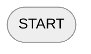
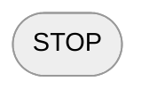
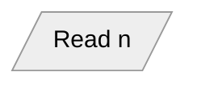
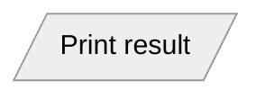
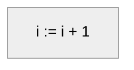
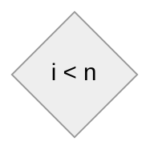
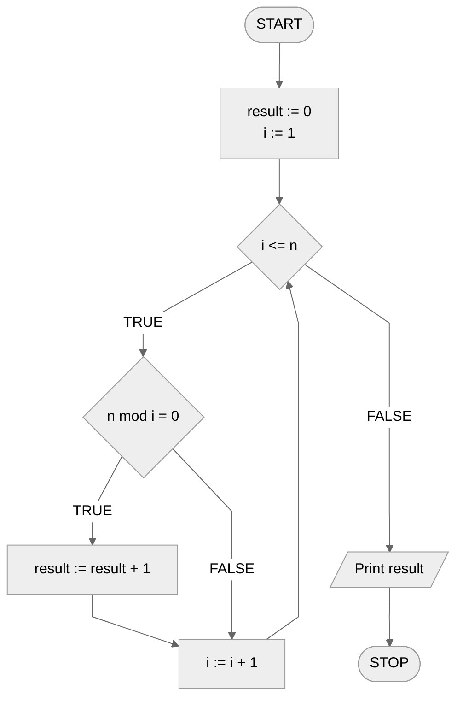

# Ways to describe algorithms

We already know the general definition of an algorithm. But before we go any further, let's discuss the different ways of writing algorithms. There are many methods, but we will focus on three of them: **pseudocode**, **block diagram** and **implementation**. Nevertheless, it is also worth learning about the others.

!!! info
    The algorithm discussed on this page is purely illustrative and is intended to show the differences between different ways of writing the algorithm. If something seems unclear, do not worry - everything will be explained in the following topics.

The key element of any algorithm, as we pointed out earlier, is the specification. We will use an example specification, for which we will show how the same algorithm looks in different forms of writing.

## Specification

### Input

* $n$ - natural number

### Result

* The number of all divisors of $n$.

## Verbal description

The least formal of all the ways of describing algorithms presented here. As the name implies, we describe the algorithm using our own words, without sticking to any particular formalism. Because of this, this type of description can be helpful for brainstorming and collaborative problem solving, but will not be sufficient if we want to move on to implementation. A disadvantage of this approach may also be the lack of explicitness.

### Example

Go through consecutive numbers from $1$ to $n$ ($1,2,3,4,...$). As you go through the successive numbers, count by how many of them $n$ is divisible. This will be the result of the algorithm.

## List of steps

This is a more orderly way of writing compared to the verbal description, but it still lacks the formality that is usually needed. We can think of it as dividing the verbal description into individual steps. Depending on the approach, a list of steps can be very similar to pseudocode.

### Example

```
1. Note the result equal to 0.
2. For consecutive numbers from 1 to n, perform:
    3. If n is divisible by the number being checked, then:
        4. Increase the result by 1.
5. Write out the result.
```

## Pseudocode

Pseudocode is something between a list of steps and code in a programming language of choice. As the name suggests, it is **pseudo** code. So here we are dealing with a more formal notation than a list of steps, but still subject to certain conventional notations and rules. However, there is no single agreed-upon formalism, so you can encounter many different approaches to pseudo-code notation.

### Example

```
1. result := 0
2. From i := 1 to n, do:
    3. If n mod i = 0, then:
        4. result := result + 1
5. Print result
```

## Block diagram

Block diagram is one of the most formal and unambiguous ways of writing algorithms. As the name suggests, here we are dealing with blocks, which are connected to each other by arrows, indicating the order in which operations are performed. Each block has its own type and purpose, which are defined by its shape. In basic notation, we distinguish the following blocks:

### Starting block



It's where everything starts. Its role is to define the beginning of the program.

### Final block - terminator



Determines the completion of the calculation.

### Input block



Here we load the input data. Since the input and output block have the same shape, for readability we add information that we are loading data, usually in the form of an abbreviation, e.g.: input, read, in.

### Output block



Here we write out messages and values, or return the result of calculations. As with the input block, we add an abbreviation indicating the type of operation, e.g.: output, print, out.

### Calculation block



In this block we perform all calculations, as well as initialization and assignment of values to variables.

### Conditional instruction block



The only block from which two arrows come out, usually to the left and right. To these arrows, we usually add captions like "Yes"/"No", "True"/"False", or "True"/"False" specifying which direction the program's calculations should continue to go depending on whether the condition is met or not.

### Example



## Code in a programming language

The most formal and accurate description of an algorithm is its implementation in the programming language of choice.

### Example

#### C++

```cpp linenums="1"
#include <iostream>

using namespace std;

int main() {
    int n, result;
    
    cin >> n;
    
    result = 0;
    
    for(int i = 1; i <= n; i++) {
        if (n % i == 0) {
            result += 1;
        }
    }
    
    cout << result << endl;
    
    return 0;
}
```

#### Python

```python linenums="1"
n = int(input())

result = 0

for i in range(1, n + 1):
    if n % i == 0:
        result += 1

print(result)
```

#### Pascal

```delphi linenums="1"
program divisors;
var n, result, i: integer;
begin
	read(n);
	
	result := 0;
	
	for i:=1 to n do begin
		if n mod i = 0 then begin
			result := result + 1;
		end;
	end;
	
	writeln(result);
end.
```
