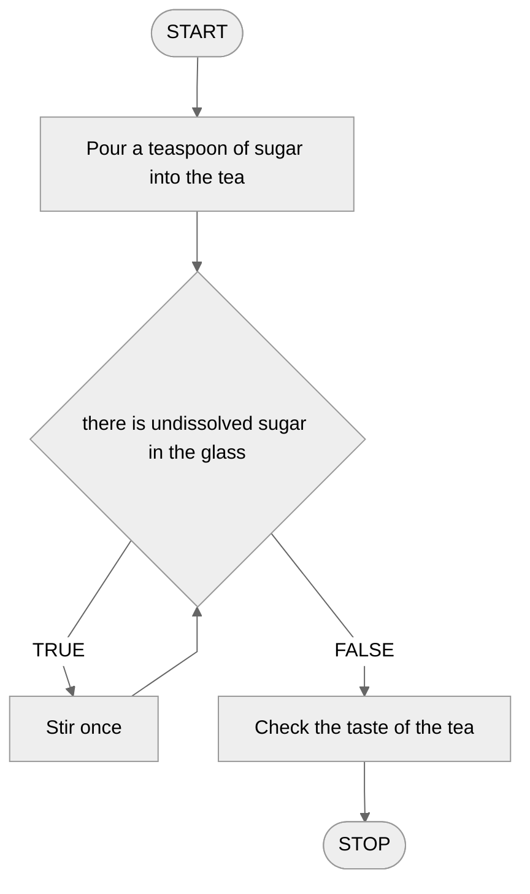
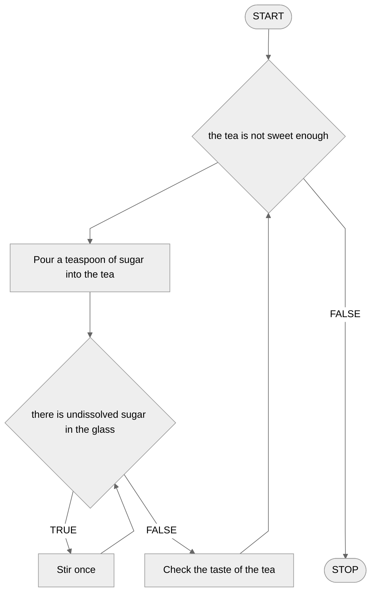

# Conditional loop

It is very common that we need to repeat certain operations many times. Let's look at an example with lights from the introduction to the conditional instruction. In the algorithm we specified that when the light is red, we are to stand and wait. All nice and beautiful, but what if the light changes to green? Should we then run the algorithm again? We can do just that. However, there is also another solution. We know that at traffic lights we should wait until the light turns green. So we could say: stop, **until the light is red**. Or also: **as long as the light is red then stop**. This is the conditional loop. The key word here is **until**, from English **while**.

## Simple loop

Let's start with a simple loop - a single conditional loop inside which there are some operations to repeat. In order to better understand how the loop works, let's consider an example.

### Example - tea sweetening algorithm

Consider the following problem: there is a bitter tea in front of us. Our task is to sweeten it with a teaspoon of sugar, and then stir it so that the sugar dissolves. Note, however, that we don't know in advance how long it will take to stir the tea. Maybe you only need to stir a few times when the tea is hot, or maybe you will need to stir longer. Therefore, a conditional loop will be helpful here.

Let's consider: what is the condition for stirring the tea? When do we need to stir the tea one more time? Then, when we have undissolved sugar in the glass. So let's try to construct an algorithm for sweetening tea.

#### List of steps

```
1. Pour a teaspoon of sugar into the tea
2. While there is undissolved sugar in the glass, do:
    3. Stir once
4. Check the taste of the tea
```

Note the indentation in the algorithm example above. This is how we often specify that an instruction is inside a loop, just as we did with the conditional statement.

#### Block diagram



Take a close look at the block diagram above. Notice that we do not have a separate block for the conditional loop. We use a conditional statement to implement the loop, and then run the corresponding arrow just before that statement, thereby _**looping**_ our diagram.

## Nested loop

We already know what a simple conditional loop looks like. However, sometimes one loop is not enough. Sometimes we need to nest two (or more) loops inside each other, thus getting multiple repetitions. Let's see what this looks like in an example.

### Example - multiple sweetening of tea

We will again consider the problem of sweetening tea. Note that in the previous example we sweetened the tea with one teaspoon of sugar. But what if someone likes his tea sweetened with two, three or even four teaspoons of sugar? We need a **second loop** to sweeten the tea multiple times.

How to dissolve sugar in tea we already know. The question now is: how long to sweeten the tea? The answer seems simple: as long as the tea is not sweet enough for us then we will sweeten it. So let's try to construct an algorithm.

#### List of steps

```
1. While the tea is not sweet enough, do:
    2. Pour a teaspoon of sugar into the tea.
    3. While there is undissolved sugar in the glass, do:
        4. Stir once
    5. Check the taste of the tea
```

Note the double indentation in the above notation. Instruction 4 is located inside two loops.

#### Block diagram


