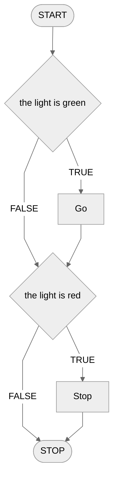
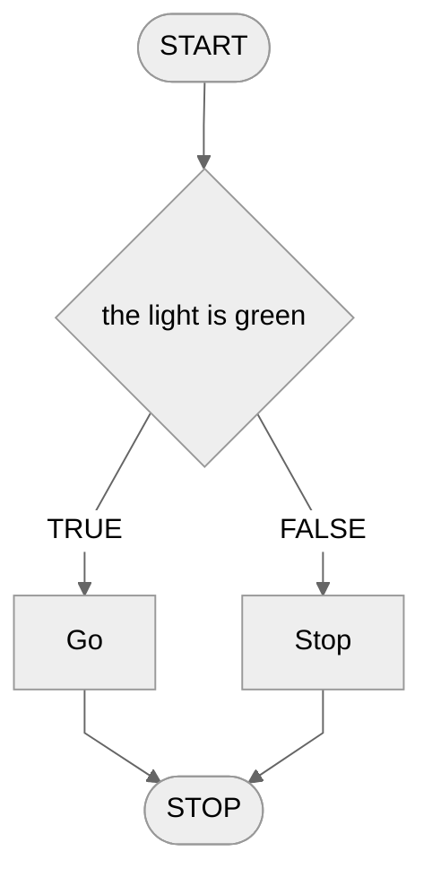
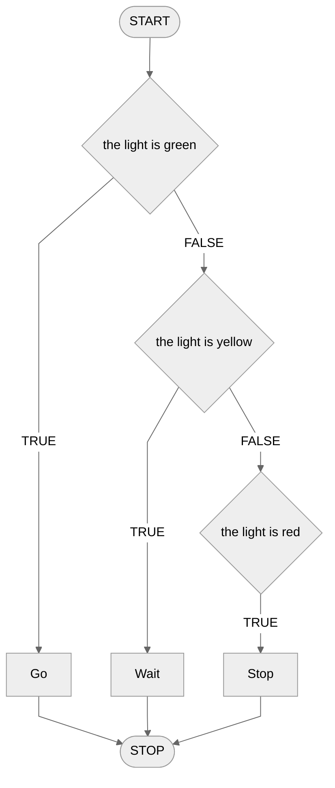
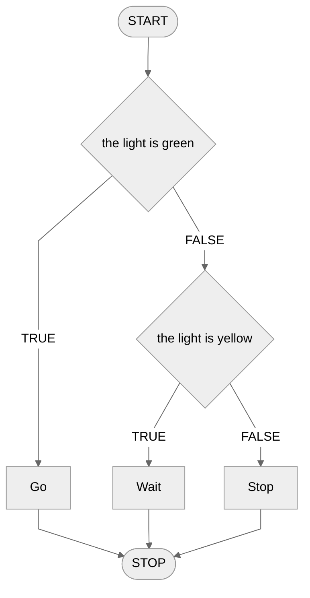
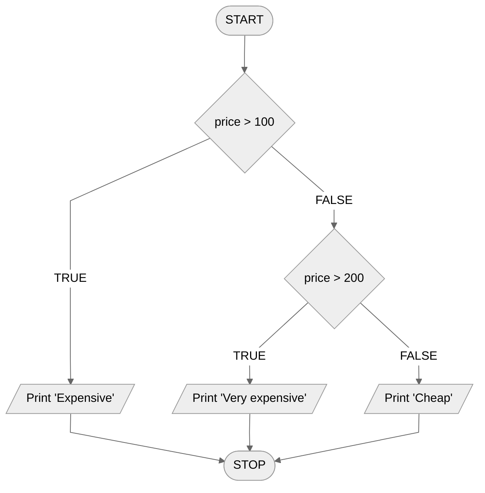
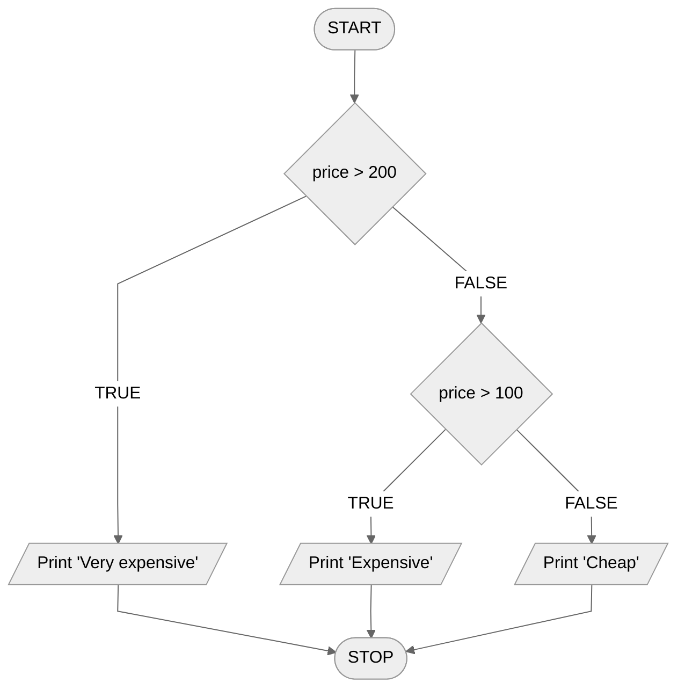

# Conditional statement

Using only linear algorithms, we would not be able to solve many problems. Why? The design of linear algorithms is too... linear. Sometimes we have to make different decisions depending on the situation at hand. Imagine the problem of crossing the street. Can you construct a linear algorithm for safely crossing a crosswalk? We can't just write "cross the lanes" because there might be a car coming! You should first look around to the side and only then, **if** nothing is driving, cross the street.

The key word here is: **if**. Depending on whether cars are driving or not, we will perform different actions. If cars are driving, we will wait. And if nothing is driving, we can pass. We will call such a construction a **conditional statement**.

The use of conditional instructions makes it possible for the execution of our program to have different courses of action, that is, different instructions can be executed depending on certain conditions.

## A simple conditional statement

Let's start with a simple example. Again, let's imagine a pedestrian crossing, but this time there are traffic lights. How to cross a crosswalk at traffic lights everyone should know. Let's try to construct an algorithm for this operation.

### Example 1

Let's first consider what it looks like to cross at a traffic light. First, we look at the lights and, depending on their color, we either cross the street or wait. Then our decision, or the operation we perform, depends on the color of the lights. These colors can be two: green or red. So we will use two conditional instructions.

#### List of steps

```
1. If the light is green, then:
    2. Go.
    
3. If the light is red, then:
    4. Stop
```

Note the indentation in the above notation. Usually, to signal that an instruction is inside a conditional statement, we use indentation.

#### Block diagram



### Example 2

We can also construct the same algorithm in a slightly different way. Note that we consider only two possible colors of lights. So we could also say that if the light is green, we cross the street, and **in** **every other case** we stand and wait. Let's try to write this down in the form of an algorithm.

#### List of steps

```
1. If the light is green, then:
    2. Go
3. otherwise:
    4. Stop
```

#### Block diagram



## Complex conditional statement

Now let's consider another example: traffic lights for drivers. Unlike pedestrian lights, here we have three different colors: green, yellow and red. So let's try to construct a suitable algorithm.

### Example 1

#### List of steps

```
1. If the light is green, then:
    2. Go
3. otherwise, if the light is yellow, then:
    4. Wait
5. otherwise, if the light is red, then:
    6. Stop
```

#### Block diagram



### Example 2

As before, we do not need to specify all the cases exactly. This time it is enough to specify the first two, because we know that if the light is not green or yellow, we have to stand and wait.

#### List of steps

```
1. If the light is green, then:
    2. Go
3. otherwise, if the light is yellow, then:
    4. Wait
5. otherwise:
    6. Stop
```

#### Block diagram



## The design of the conditions must be well thought out

In the previous examples, it did not matter in which order we consider the subsequent conditions. We could swap the order of the conditional instructions (along with the operations, of course) and we would still have a properly working algorithm. However, life is not always that simple....

### Example 1

#### List of steps

```
1. If price > 100, then:
    2. Print "Expensive"
3. otherwise, if price > 200, then:
    4. Print "Very expensive"
5. Otherwise:
    6. Print "Cheap"
```

#### Block diagram



Can you tell what is wrong with the above conditional instruction? Its design itself is correct, but not well thought out and may mislead the reader. Try to _simulate_ the operation of the algorithm for different price values. Think about what the price must be for each message to be output, i.e. for which values the message "expensive" will be output, for which "very expensive" and for which the message "cheap" will be output. Take a moment to do this exercise yourself before continuing.

Notice that the "very expensive" message will never be output. Why does this happen? Just take a close look at the construction of the conditions. The first condition specifies what is to happen for prices greater than 100, while the second condition specifies what is to happen for prices greater than 200. It would seem, therefore, that for a value of 300, for example, the second condition will be met and the message "very expensive" will be output. However, this will not happen. Why?

This is because for such a price **the first condition is already satisfied**. And since the first condition is already satisfied, the subsequent conditions will no longer be checked and executed.

Of course, the above algorithm can be easily improved by swapping the order of the conditions, as the following example shows.

### Example 2

#### List of steps

```
1. If price > 200, then:
    2. Print "Very expensive"
3. otherwise, if price > 100, then: 
    4. Print "Expensive"
5. otherwise:
    6. Print "Cheap"
```

#### Block diagram


