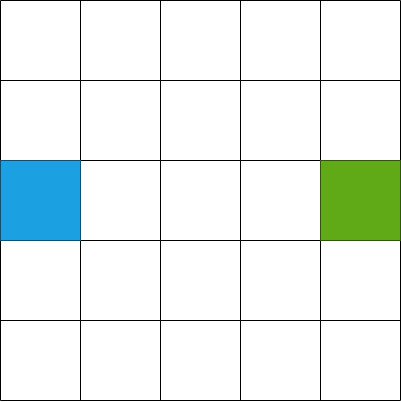
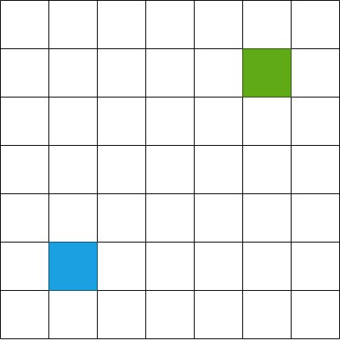
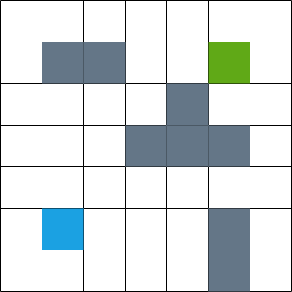
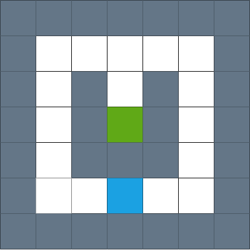
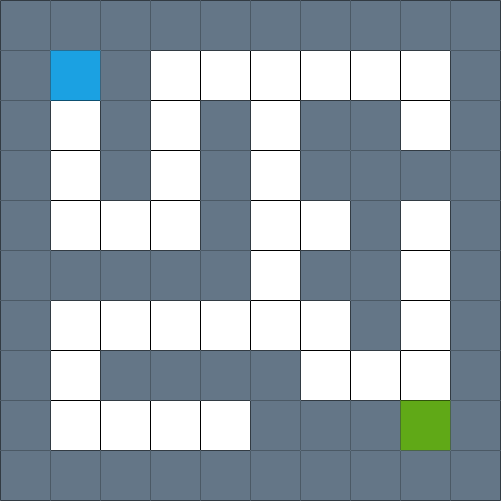
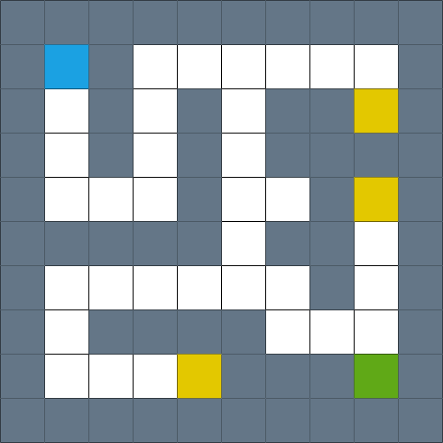

# Exercises

We have learned the basics of algorithmics and algorithm representation, then it is now time for a simple exercise. Our task will be to guide a robot from the start to the finish line. To do this, we will create a set of instructions for the robot: **algorithm** that will lead it to the goal, i.e. **solve the given problem**.

## Basic rules

- The starting field is marked in blue.
- The finish line is marked in green.
- The robot starts at the starting field. Its goal is to reach the finish line.
- In each step the robot can move one field.

The following instructions are available:

- Right.
- Left.
- Top.
- Bottom.

Each instruction makes the robot move one field in the indicated direction.

## Exercise 1



### Example solution - linear algorithm

```
1. Right.
2. Right.
3. Right.
4. Right.
```

### Example solution - algorithm with a loop

```
1. Repeat 4 times:
    2. Right.
```

## Exercise 2



## Exercise 3

**New rule**: **gray** blocks mark walls. You cannot walk through the walls or stand on them, so you must avoid them.



## Exercise 4



## Exercise 5



## Exercise 6

**New rule**: **yellow** boxes stand for treasure. Before reaching the finish line, you must collect **all treasures**, i.e. visit each yellow field.



## Exercise 7

New rules:

- We move from the robot's perspective.
- We use a new set of instructions.
- The robot is initially facing **down** (south).

New set of instructions:

- Go forward.
- Turn to the left.
- Turn right.

