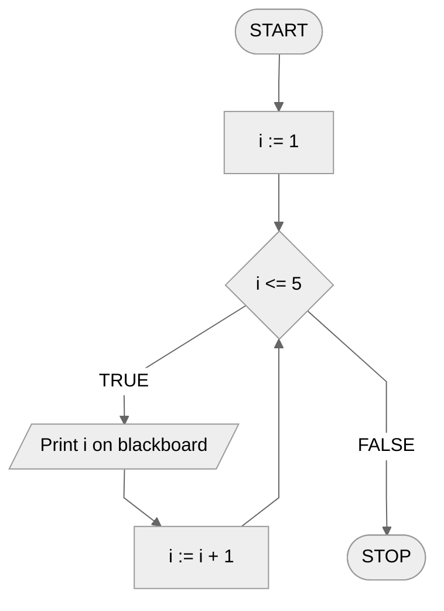

# Iterative loop

## Simple loop

Sometimes we want to repeat something several times. We don't have any specific condition to meet, we just need to repeat a certain operation multiple times. We could then write the given operation several times, one under the other, but it is much more convenient to use a loop.

### Example

#### Without loop

```
1. Volunteer for the blackboard
2. Volunteer for the blackboard
3. Volunteer for the blackboard
```

#### With loop

```
1. Repeat 3 times:
    2. Volunteer for the blackboard
```

## Variable number of repetitions

It may also be the case that we do not know in advance how many times we will have to repeat a certain operation. Perhaps it depends on other calculations, or maybe on the input data. In that case, we could not write several repetitions of the given operation one under the other, because we do not know how many would have to be! However, we can implement this easily with a loop.

### Example

```
1. Read n
2. Repeat n-times:
    3. Volunteer for the blackboard
```

## Loop with counter

Sometimes it is not enough for us to repeat a certain operation multiple times. Sometimes we need to **count** something at the same time, for example, the repetitions of a loop just now. That's when a **loop counter** comes in handy.

When using a loop with a counter, we should specify the **range** from which the counter will take successive values. It's a bit like counting something ourselves, e.g. from $1$ to $5$. The starting point, that is, the initial value of the counter will be $1$, and the last value the counter will reach will be $5$. In subsequent **runs** (**repeats**) of the **loop**, the counter will take successive values from the set range, so for example, the values will be: $1,2,3,4,5$.

### Example

#### Without loop

```
1. Print 1 on blackboard
2. Print 2 on blackboard
3. Print 3 on blackboard
4. Print 4 on blackboard
5. Print 5 on blackboard
```

#### With loop with counter

```
1. From i := 1 to 5, do:
    2. Print i on blackboard
```

#### Block diagram



Note that, as with the conditional loop, for the iterative loop we also do not have a special block. In fact, in the block diagram, we implement the iterative loop as a conditional loop, because any iterative loop can be implemented with a conditional loop.

## Loop step

The loop step determines by how much the value of the loop counter changes in each loop pass. The default iteration loop step is $1$. If we use the default value, we usually do not write a loop step. However, we can easily modify it, as the following examples show.

### Example - even numbers

Let's say our task is to write out on the array consecutive even numbers from $2$ to $10$ inclusive. We could pass through successive values in this range and, if the number is even, write it out on the array. We could also modify the loop step to pass **only** through successive even numbers.

```
1. From i := 2 to 10, with step 2, do:
    2. Print i on blackboard
```

Without loop:

```
1. Print 2 on blackboard
2. Print 4 on blackboard
3. Print 6 on blackboard
4. Print 8 on blackboard
5. Print 10 on blackboard
```

### Example - counting down

What if we want to count from $5$ to $1$? Here, too, we can use an iterative loop with an appropriate step.

```
1. From i := 5 to 1, with -1, do:
    2. Print i on blackboard
```

Without loop:

```
1. Print 5 on blackboard
2. Print 4 on blackboard
3. Print 3 on blackboard
4. Print 2 on blackboard
5. Print 1 on blackboard
```
