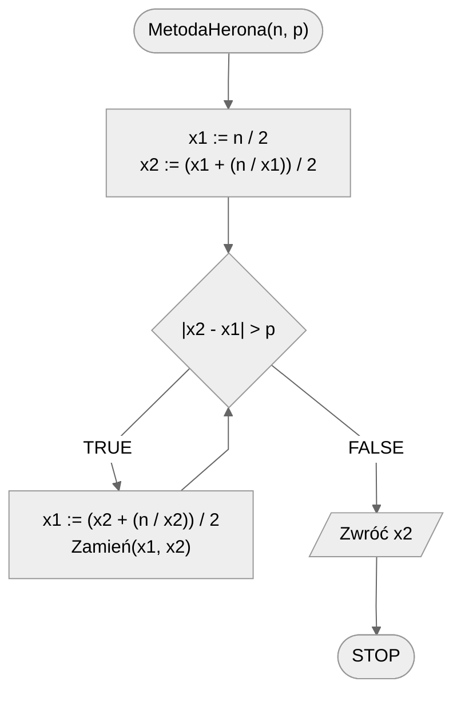

# Pierwiastek kwadratowy

Jak policzyć pierwiastek kwadratowy z podanej liczby, gdy nie mamy przy sobie kalkulatora, ani wbudowanych metod programistycznych?

## Specification

### Input

* $n$ — liczba do spierwiastkowania, $n\in\mathbb{R}$
* $p$ — oczekiwana dokładność obliczeń, $p\in\mathbb{R}$

### Output

* $\sqrt{n}$ policzony z dokładnością $p$

## Solution — metoda Herona

### Pseudocode

```
funkcja MetodaHerona(n, p)
    1. x1 := n / 2
    2. x2 := (x1 + (n / x1)) / 2
    3. Dopóki |x2 - x1| > p, wykonuj:
        4. x1 := (x2 + (n / x2)) / 2
        3. Zamień(x1, x2)
    4. Zwróć x2
```

### Block diagram



## Implementation

### [:simple-cplusplus: C++](../../programming/c++/algorithms/numerical-methods/square-root.md){ .md-button }

### [:simple-python: Python](../../programming/python/algorithms/numerical-methods/square-root.md){ .md-button }
