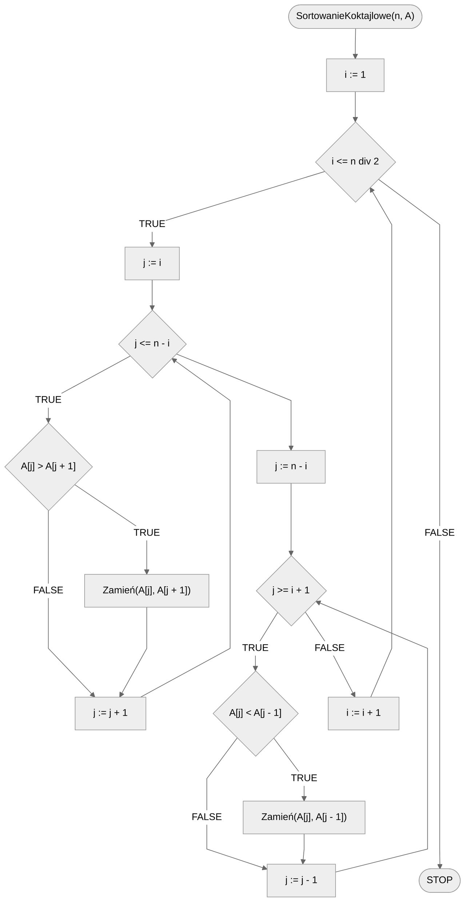

# Sortowanie koktajlowe

Sortowanie koktajlowe, znane również jako sortowanie bąbelkowe z wstrząsami (ang. *Cocktail Shaker Sort*) lub sortowanie bidirectionalne, to odmiana algorytmu sortowania bąbelkowego. Podobnie jak sortowanie bąbelkowe, sortowanie koktajlowe jest prostym algorytmem, ale niezbyt wydajnym dla dużych zbiorów danych.

Algorytm sortowania koktajlowego różni się od sortowania bąbelkowego tym, że przegląda listę w obu kierunkach. Oznacza to, że podczas jednego przejścia lista jest przeglądana od początku do końca, a następnie od końca do początku. Proces ten powtarza się, aż do momentu, gdy cała zostanie jest posortowana.

Algorytm sortowania koktajlowego opiera się na następujących krokach:

- Przeglądanie listy: przeglądamy listę od początku do końca, porównując sąsiednie elementy. Jeżeli są w niewłaściwej kolejności, zamieniamy je miejscami.
- Przeglądanie listy w drugą stronę: teraz przeglądamy listę od końca do początku, ponownie porównując sąsiednie elementy i zamieniając je miejscami, jeśli są w niewłaściwej kolejności.
- Powtarzanie: powtarzamy powyższe kroki, aż cała lista będzie posortowana.

Poniżej znajdziesz animację przedstawiającą ideę omawianego algorytmu.

## Animacja

[Sortowanie koktajlowe](https://blackbat13.github.io/visul2/sorting/cocktail_shaker_sort/#array=%5B6%2C5%2C3%2C1%2C8%2C7%2C2%2C4%5D){ .md-button }

## Solution

### Pseudocode

```
procedura SortowanieKoktajlowe(n, A):
    1. Od i := 1 do n div 2, wykonuj:
        2. Od j := i do n - i, wykonuj:
            3. Jeżeli A[j] > A[j + 1], to:
                4. Zamień(A[j], A[j + 1])
        5. Od j := n - i w dół do i + 1, wykonuj:
            6. Jeżeli A[j] < A[j - 1], to:
                7. Zamień(A[j], A[j - 1]
```

!!! info
	 **div** oznacza dzielenie całkowite

### Block diagram



### Complexity

Podobnie jak sortowanie bąbelkowe, sortowanie koktajlowe ma złożoność obliczeniową $O(n^2)$ zarówno w przypadku średnim, jak i najgorszym. Wynika to z przeglądania całej listy dla każdego elementu.

## Implementation

### [:simple-cplusplus: C++](../../programming/c++/algorithms/sorting/cocktail-shaker-sort.md){ .md-button }

### [:simple-python: Python](../../programming/python/algorithms/sorting/cocktail-shaker-sort.md){ .md-button }

### [:simple-kotlin: Kotlin](../../programming/kotlin/algorithms/sorting/cocktail-shaker-sort.md){ .md-button }
