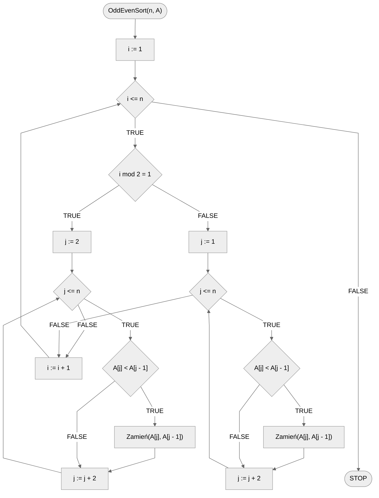

# Sortowanie odd-even

Sortowanie nieparzysto-parzyste (ang. *Odd-even*), znane również jako sortowanie bąbelkowe dwufazowe lub sortowanie Brick Sort, to algorytm sortujący, który działa na zasadzie porównywania wszystkich par elementów nieparzysto-parzystych (indeksy są parzyste lub nieparzyste) listy, które następnie, jeśli są w złej kolejności, są zamieniane miejscami. Ta operacja jest powtarzana, aż lista zostanie posortowana.

Algorytm sortowania nieparzysto-parzystego składa się z następujących kroków:

- **Faza nieparzysta**: przeglądaj całą listę i dla każdej pary elementów na nieparzystych pozycjach $i$, jeżeli element na pozycji $i$ jest większy od elementu na pozycji $i+1$, zamień je miejscami.

- **Faza parzysta**: przeglądaj całą listę i dla każdej pary elementów na parzystych pozycjach $i$, jeżeli element na pozycji $i$ jest większy od elementu na pozycji $i+1$, zamień je miejscami.

- **Powtarzaj fazy**: powtarzaj powyższe fazy, aż lista zostanie całkowicie posortowana.

Algorytm ten kontynuuje te dwie fazy, dopóki nie posortuje całej listy. Głównym założeniem jest to, że po każdej iteracji najmniejszy element porusza się co najmniej o jedną pozycję do przodu.

Poniżej znajdziesz animację przedstawiającą ideę omawianego algorytmu.

## Animacja

[Sortowanie odd-even](https://blackbat13.github.io/visul2/sorting/odd_even_sort/#array=%5B6%2C5%2C3%2C1%2C8%2C7%2C2%2C4%5D){ .md-button }

## Solution

### Pseudocode

```
procedura OddEvenSort(n, A):
    1. Od i := 1 do n, wykonuj:
        2. Jeżeli i mod 2 = 1, to:
            3. Dla j := 2 do n, z krokiem 2, wykonuj:
                4. Jeżeli A[j] < A[j - 1]:
                    5. Zamień(A[j], A[j - 1])
        6. w przeciwnym przypadku:
            7. Dla j := 1 do n, z krokiem 2, wykonuj:
                8. Jeżeli A[j] < A[j - 1]:
                    9. Zamień(A[j], A[j - 1])
```

### Block diagram



### Complexity

Algorytm sortowania nieparzysto-parzystego ma złożoność obliczeniową $O(n^2)$, zarówno w przypadku średnim, jak i najgorszym. Jest to więc algorytm nieefektywny dla dużych zestawów danych.

## Implementation

### [:simple-cplusplus: C++](../../programming/c++/algorithms/sorting/odd-even-sort.md){ .md-button }

### [:simple-python: Python](../../programming/python/algorithms/sorting/odd-even-sort.md){ .md-button }

### [:simple-kotlin: Kotlin](../../programming/kotlin/algorithms/sorting/odd-even-sort.md){ .md-button }
