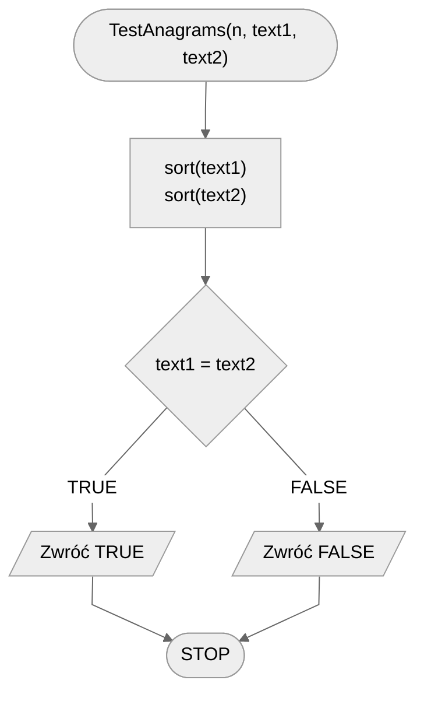

# Anagrams

There are many methods for checking and creating relationships between words.
In this topic we will deal with the concept of **anagram**, which may be familiar especially to those who have a penchant for various types of crossword puzzles and word puzzles.
Let's start with a brief definition.

## Definition

!!! info
	 Two words are called **anagrams** if they consist of exactly the same characters, but arranged in a different order.

### Link to Wikipedia

[Anagram - Wikipedia](https://en.wikipedia.org/wiki/Anagram){ .md-button }

## Example

Words **listen** and **silent** are anagrams.
Similarly words **algorithm** and **logarithm**.

Not only words can be anagrams, but also phrases or whole sentences.

## Specification

### Input

* $n$ — natural number, text length.
* $text1[1..n]$ — a string of $n$ characters, numbered from one, consisting only of lowercase letters of the English alphabet.
* $text2[1..n]$ — a string of $n$ characters, numbered from one, consisting only of lowercase letters of the English alphabet.

!!! info
	In the general problem, we could check the anagram property for any strings of characters, in particular, those that also contain uppercase letters of the alphabet.
	However, we will focus on a simplified version of this problem to present the idea of the solution, and leave the technicalities to those interested.

### Output

* $TRUE$ — if $text1$ and $text2$ are anagrams.
* $FALSE$ — otherwise.

## Example

### Input

```
n := 7
text1 := "cheater"
text2 := "teacher"
```

**Output**: **TRUE**

## Solution 1

### Description

For two words to be anagrams, they must consist of exactly the same letters.
This also means that each letter from the first word must appear in the second word exactly the same number of times and the same in the other direction.
Therefore, the first solution is simple: let's count how many times each letter occurs in the first word, then do the same for the second word and compare the results.
If they are the same, the two words are anagrams.

But how to count how many times a letter occurs in a word?
Let's note that our words consist only of lowercase letters of the English alphabet.
This means that we have exactly 26 characters.
So we can prepare an array storing 26 counters - one for each letter.
The letters, on the other hand, will be numbered starting from 1, starting from $a$.
We will store the number of occurrences of the letter $a$ in the first counter, the number of occurrences of the letter $b$ in the second counter, and so on.

### Example

Assume the same data as in the earlier example, ie.:

```
n := 7
text1 := "cheater"
text2 := "teacher"
```

We begin by counting the arrays of counters for the first and second words.
For readability, we will write them in a modified form, adding the corresponding letter to each counter.
This is how we get the arrays of counters for the first and second words, respectively:

```
counters1 = [a:1, b:0, c:1, d:0, e:2, f:0, g:0, h:1, i:0, j:0, k:0, l:0, m:0, n:0, o:0, p:0, q:0, r:1, s:0, t:1, u:0, v:0, w:0, x:0, y:0, z:0]
counters2 = [a:1, b:0, c:1, d:0, e:2, f:0, g:0, h:1, i:0, j:0, k:0, l:0, m:0, n:0, o:0, p:0, q:0, r:1, s:0, t:1, u:0, v:0, w:0, x:0, y:0, z:0]
```

When we compare them we will see that they are equal to each other.
This means that our words are anagrams.

### Pseudocode

Now let's try to write our solution in a more formal way.
We will design a function **TestAnagrams** that will take three parameters, according to the specification.

First, we create two arrays of counters, one for each word.
Initially, we fill them with values of 0, since we have not yet proceeded to count the letters in the words.

When the arrays are ready, we can proceed with the counting.
We go through both words character by character and increment the correct counters in the corresponding word arrays.

The last step is to compare our counters and return the corresponding result.

```
function TestAnagrams(n, text1, text2):
    1. counters1 := array [1..26] filled with values 0
    2. counters2 := array [1..26] filled with values 0 
    3. from i := 1 to n, do:
        4. index1 := character number of text1[i]
        5. counters1[index1] := counters1[index1] + 1
        6. index2 := character number of text2[i]
        7. counters2[index2] := counters2[index2] + 1
    8. if counters1 = counters2, then:
        9. return TRUE
    10. otherwise:
        11. return FALSE
```

### Complexity

The most time-consuming operation in our algorithm is the loop going through each character of both words.
We have $n$ characters, so our loop will perform exactly $n$ turns, which gives us complexity:

$O(n)$ — linear

## Solution 2

Another solution is to sort the two words and compare them.

### Pseudocode

```
function TestAnagrams(n, text1, text2):
    1. sort(text1)
    2. sort(text2)
    3. if text1 = text2, then:
        4. return TRUE
    5. otherwise:
        6. return FALSE
```

### Block diagram



### Complexity

$O(n)$ — linear, if we use an optimal sorting algorithm (such as sorting by counting).

$O(n\log{n})$ — Linear logarithmic, if we use a standard sorting method (e.g., quick sort).

## Implementation

### [:simple-cplusplus: C++](../../programming/c++/algorithms/text/anagrams.md){ .md-button }

### [:simple-python: Python](../../programming/python/algorithms/text/anagrams.md){ .md-button }
