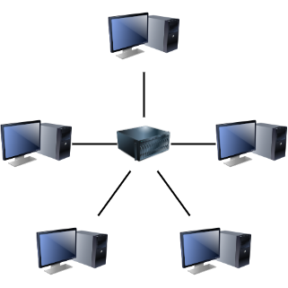
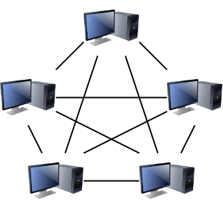

# Topologia sieci komputerowych

Kiedy mówimy o sieci komputerowej, myślimy o zestawie komputerów i innych urządzeń połączonych ze sobą, które mogą wymieniać dane i zasoby. Jednak kluczowym aspektem, który determinuje, jak te komputery są połączone, jest **topologia sieci**.

Topologia sieci to w istocie mapa lub schemat, który pokazuje, jak komputery, nazywane także węzłami, są ze sobą połączone w sieci. Określa ona zarówno fizyczny układ sieci, czyli sposób, w jaki wszystkie komponenty sieci są połączone fizycznie, jak i logiczny układ sieci, który opisuje, jak dane przepływają przez sieć od jednego urządzenia do drugiego.

Wybór odpowiedniej topologii jest kluczowy dla funkcjonowania sieci. Może to mieć wpływ na wiele aspektów, takich jak wydajność sieci, jej odporność na awarie, łatwość zarządzania i koszty. To właśnie dlatego zrozumienie topologii sieci i jej różnych typów jest niezbędne dla każdego, kto chce zrozumieć, jak działają sieci komputerowe, jak nimi zarządzać i jak je konfigurować.

## Topologia magistrali (Bus)

W tej topologii wszystkie komputery są połączone za pomocą jednego długiego kabla, zwanego magistralą. Komunikacja odbywa się w obie strony na tej samej magistrali. Jest to najprostsza i najtańsza topologia, ale ma ograniczenia jeśli chodzi o skalowalność i odporność na awarie.

## Topologia pierścienia (Ring)

W topologii pierścienia, każdy komputer jest połączony z dwoma innymi komputerami, tworząc krąg. Informacje przesyłane są w jednym kierunku od jednego komputera do kolejnego aż do miejsca przeznaczenia. Topologia pierścienia jest łatwa w zarządzaniu, ale awaria jednego węzła może przerwać całą sieć.

## Topologia gwiazdy (Star)

W tej topologii wszystkie komputery są połączone z centralnym węzłem, którym może być komputer, switch lub hub. Gwiazda jest najpopularniejszą topologią, ponieważ awaria jednego węzła nie wpływa na całą sieć, a dodanie nowego węzła jest stosunkowo proste. Jednak koszty są wyższe, a cała sieć zależy od działania centralnego węzła.

## Topologia siatki (Mesh)

W topologii siatki, każdy komputer jest połączony z każdym innym komputerem. Oferuje ona doskonałą odporność na awarie i optymalizację przepływu danych, ale jest kosztowna i trudna do zarządzania z powodu dużej liczby połączeń.

## Topologia drzewa (Tree)

Jest to hybrydowy typ topologii, który łączy kilka topologii gwiazdy w hierarchicznym układzie. Korzeń drzewa to główny węzeł, a pozostałe węzły są połączone jak w topologii gwiazdy.

## Topologia hybrydowa (Hybrid)

Jak sama nazwa wskazuje, topologia hybrydowa łączy dwa lub więcej różnych typów topologii, zapewniając elastyczność i skalowalność.
