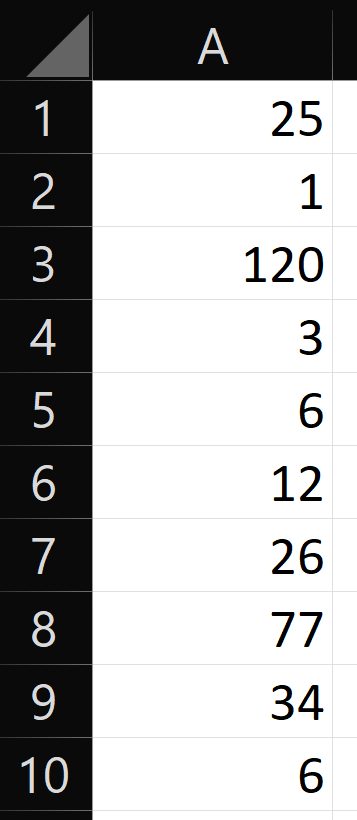
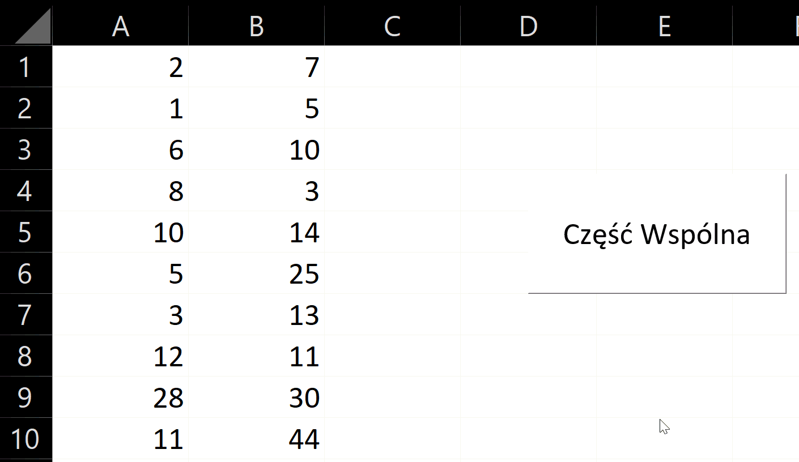
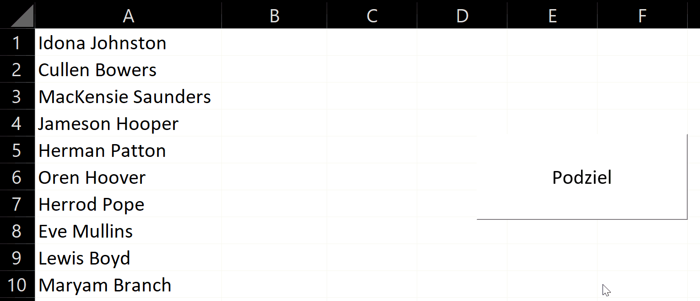

# Zaawansowane

## Zadanie 1

Napisz funkcję `SzukajMax`, która dla podanego zakresu komórek, znajdzie i zwróci jako wynik adres komórki zawierającej wartość maksymalną. Jeżeli kilka komórek zawiera tę wartość, funkcja powinna zwrócić adres pierwszej z nich.

### Przykład



```
SzukajMax(A1:A10) = $A$3
```

## Zadanie 2

Stwórz przycisk, który po kliknięciu pokoloruje wszystkie komórki w zakresie `A1:A10`, które zawierają wartość poniżej średniej z tego zakresu.

### Przykład


## Zadanie 3

Stwórz przycisk, który po kliknięciu wpisze w kolumnie C wszystkie wartości z zakresu `A1:A10`, które występują jednocześnie w zakresie `B1:B10`. Możesz założyć, że w obu zakresach wartości są unikalne w ramach danego zakresu.

### Przykład



## Zadanie 4

Komórki `A1:A10` zawierają imiona i nazwiska oddzielone pojedynczą spacją. Stwórz przycisk, który po kliknięciu umieści w kolumnie B imiona, a w kolumnie C nazwiska z odpowiadających komórek z kolumny A.

### Przykład



## Zadanie 5

Napisz funkcję `ZliczWyrazy`, która dla podanego tekstu zwróci liczbę wyrazów w nim zawartych. Za wyraz uznajemy ciąg znaków nie zawierający spacji, a wyrazy są oddzielone pojedynczą spacją.

### Przykład

```
ZliczWyrazy("Ala ma kota") = 3
ZliczWyrazy("Ala ma kota, a kot ma Alę") = 7
```
